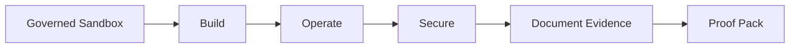

# 🧭 Ninobyte AI-Native CloudOps Lab

**Build, operate, and secure AWS AI workloads through governed lab practice.**

The AI-Native CloudOps Lab is a governed AWS training environment for practical AI CloudOps. Learners work inside a controlled sandbox to build, operate, and secure a real AWS Bedrock application — practicing the operational and security discipline that production AI workloads demand. Depth over breadth: real AWS services, documented guardrails, and evidence of work, not passive videos or unverifiable certificates.

> This repository is a **public overview only**. The curriculum, sandbox architecture, and implementation live in a private repository.

---

## 🧪 The learner journey

Every step happens inside a governed sandbox and ends in portfolio-ready proof of work.

---

## Who it is for

- AI cloud builders
- Cloud operators
- Emerging AWS / AI engineers
- Defensive cloud-security learners
- Professional learners who want evidence-based practice

---

## What learners practice

- AWS account access and sandbox discipline
- The Bedrock application lifecycle
- CloudOps troubleshooting
- Cost and safety awareness
- Documentation and proof-pack thinking
- Secure operations workflows

---

## 🔒 What is private

The private core repository holds the materials that make the lab work — kept private by design:

- Curriculum and learning design
- Sandbox architecture
- Instructor materials
- Cost and safety gates
- Lab implementation details

## 🚫 What this overview does not contain

- AWS credentials
- Terraform or infrastructure code
- Solution guides or instructor notes
- Private repository contents
- Student data
- Live lab access

---

## Relationship to the platform

The CloudOps Lab is one product line within the broader Ninobyte AWS training ecosystem, alongside the [AI Security & Governance Lab — AWS Edition](https://github.com/ninobyte-cloudops-lab/ai-security-governance-lab-overview). Together they form a governed, evidence-based path for building, operating, securing, and governing AWS AI workloads.

See also: [`ROADMAP.md`](ROADMAP.md) · [`RESPONSIBLE_USE.md`](RESPONSIBLE_USE.md)

---

## ✅ Status

Private platform foundation in development. Public overview only.

---

## Next step

Explore the [Ninobyte CloudOps Lab organization](https://github.com/ninobyte-cloudops-lab) for the full picture. For partnership, cohort, or review conversations, reach Ninobyte through its official channels.
