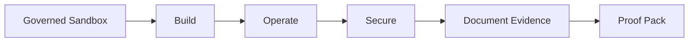

# 🧭 Ninobyte AI-Native CloudOps Lab

**Build, operate, and secure AWS AI workloads through governed lab practice.**

Most cloud courses teach services in isolation. The AI-Native CloudOps Lab is for learners who have watched the videos but still need to operate an AWS AI workload with guardrails, cost awareness, troubleshooting discipline, and evidence they can explain.

Learners practice the full loop: build the workload, operate it, secure it, investigate what changes, document the evidence, and assemble proof of work. The lab is designed for AWS-first depth, not passive videos or unverifiable certificates.

> This repository is a **public overview only**. The curriculum, sandbox architecture, and implementation live in a private repository.

> Live AWS execution remains gated until cost, safety, permission-boundary, and teardown validation are complete.

---

## Why it exists

CloudOps learners often know the vocabulary but have not had a safe place to practice the work:

- They can describe Bedrock, IAM, CloudWatch, or S3, but have not operated them together.
- They want proof of hands-on AWS AI work, not another certificate screenshot.
- They need to learn cost and account safety before touching live infrastructure.
- They need troubleshooting, documentation, and handoff practice that looks like real work.

The CloudOps Lab is built to turn that gap into governed practice.

---

## 🧪 The learner journey

Every step is designed to happen inside a governed sandbox and end in portfolio-ready proof of work once the execution gates are validated.

---

## Who it is for

- Cloud-course graduates who need real operational confidence
- AI cloud builders and emerging AWS / AI engineers
- Cloud operators learning AWS AI workload ownership
- Defensive cloud-security learners
- Professional learners who want evidence-based practice and portfolio-safe artifacts

---

## What learners practice

- Safe AWS account access and sandbox discipline
- The Bedrock application lifecycle
- CloudOps troubleshooting and operational handoff
- Cost, budget, and teardown awareness
- Secure operations workflows
- Evidence capture and proof-pack thinking

## What learners produce

The intended outcome is not only "I completed a lab." Learners produce sanitized, reviewable evidence of work:

- Architecture notes and operational decisions
- Troubleshooting records
- Cost and safety observations
- Security review notes
- A proof-pack style summary that can support a portfolio conversation without exposing private lab details

---

## 🔒 What is private

The private core repository holds the materials that make the lab work — kept private by design:

- Curriculum and learning design
- Sandbox architecture
- Instructor materials
- Cost and safety gates
- Lab implementation details

## 🚫 What this overview does not contain

- AWS credentials
- Terraform or infrastructure code
- Solution guides or instructor notes
- Private repository contents
- Student data
- Live lab access

---

## Relationship to the platform

The CloudOps Lab is one product line within the broader Ninobyte AWS training ecosystem, alongside the [AI Security & Governance Lab — AWS Edition](https://github.com/ninobyte-cloudops-lab/ai-security-governance-lab-overview). Together they form a governed, evidence-based path for building, operating, securing, and governing AWS AI workloads.

See also: [`ROADMAP.md`](ROADMAP.md) · [`RESPONSIBLE_USE.md`](RESPONSIBLE_USE.md)

---

## ✅ Status

Private platform foundation in development. Public overview only. Live AWS access and cohort readiness remain gated by cost, safety, permission-boundary, and teardown validation.

---

## Next step

Explore the [Ninobyte CloudOps Lab organization](https://github.com/ninobyte-cloudops-lab) for the full picture. For review, partnership, team-training, or future cohort conversations, reach Ninobyte through its official channels.
